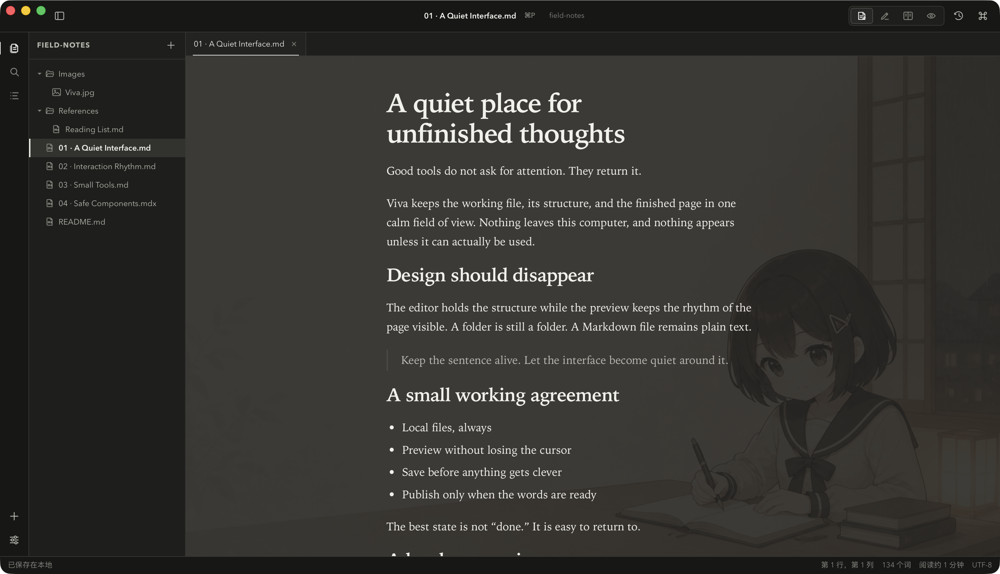

<p align="center">
  
</p>

<h1 align="center">Viva</h1>

<p align="center">一个安静、本地优先的 Markdown 工作台。</p>

<p align="center">
  <a href="README.md">English</a> · 简体中文
</p>

<p align="center">
  
</p>

Viva 把文件夹、Markdown 源文和排版后的页面放进同一个专注的桌面工作区。
文件始终留在你的电脑上，仍然是普通文件；不需要账户、同步服务或私有文档格式。

## 不离开页面，也能认真写作

Live 模式会在写作时保持整篇文档的排版。点一下段落即可原地编辑对应的 Markdown，
写完继续往下，不必在源码和预览之间反复切换。需要时，Source、Split、Preview
和 Focus 模式也随时可用。

## Viva 能做什么

- 打开任意文件夹，在真正的标签页和键盘友好的文件树里写作，也能安全地管理文件。
- 搜索整个工作区、浏览文档大纲，并找回以前保存过的版本。
- 在当前文档中查找和替换，并将粘贴的图片保存到本地 `assets/`，以相对路径引用。
- 内置 Dart、TypeScript 等常用语言的围栏代码语法高亮。
- 在编辑、另存为和恢复历史版本时，保留每篇文档原有的 LF 或 CRLF 换行格式。
- 在标签页、窗口和系统退出流程中清楚标记并保护未保存内容。
- 选择安静的浅色或石墨深色界面，也可以使用一张本地背景图。

## 默认留在本地

Viva 不上传文档、不做行为统计，也不需要账户。Markdown、历史版本、外观设置
和可选背景图都保存在本机；外部链接只有在你主动点击时才会打开。

<details>
<summary>开发</summary>

Viva 使用 Tauri、Rust、React 与 TypeScript 构建，支持 macOS 和 Windows。
开发需要 Node.js 24、pnpm 11、稳定版 Rust，以及对应平台的
[Tauri 前置环境](https://v2.tauri.app/start/prerequisites/)。

```bash
pnpm install
pnpm tauri dev
```

</details>

## 许可证

MIT
